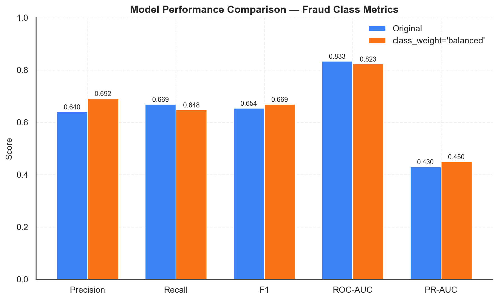
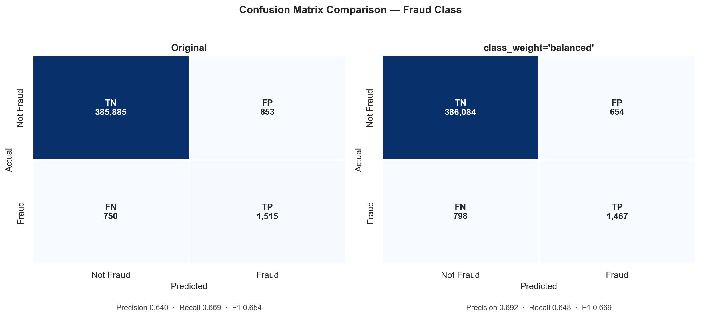
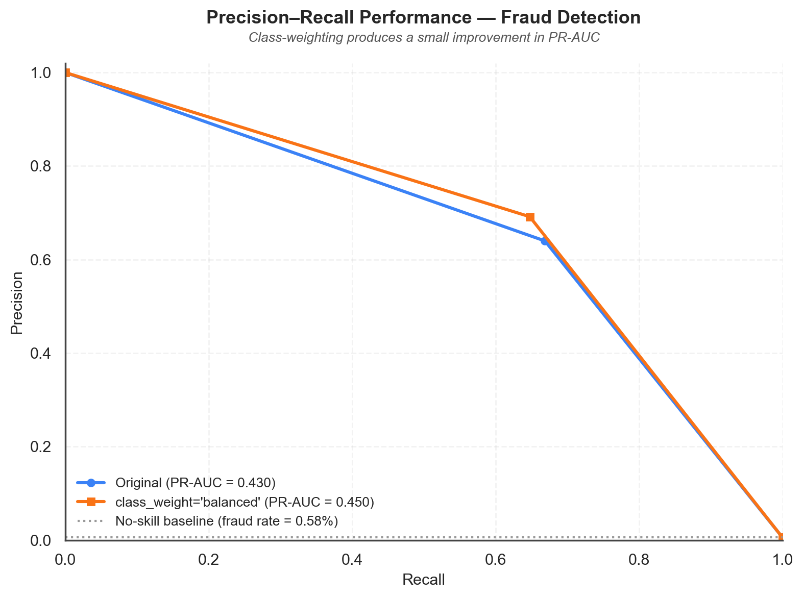
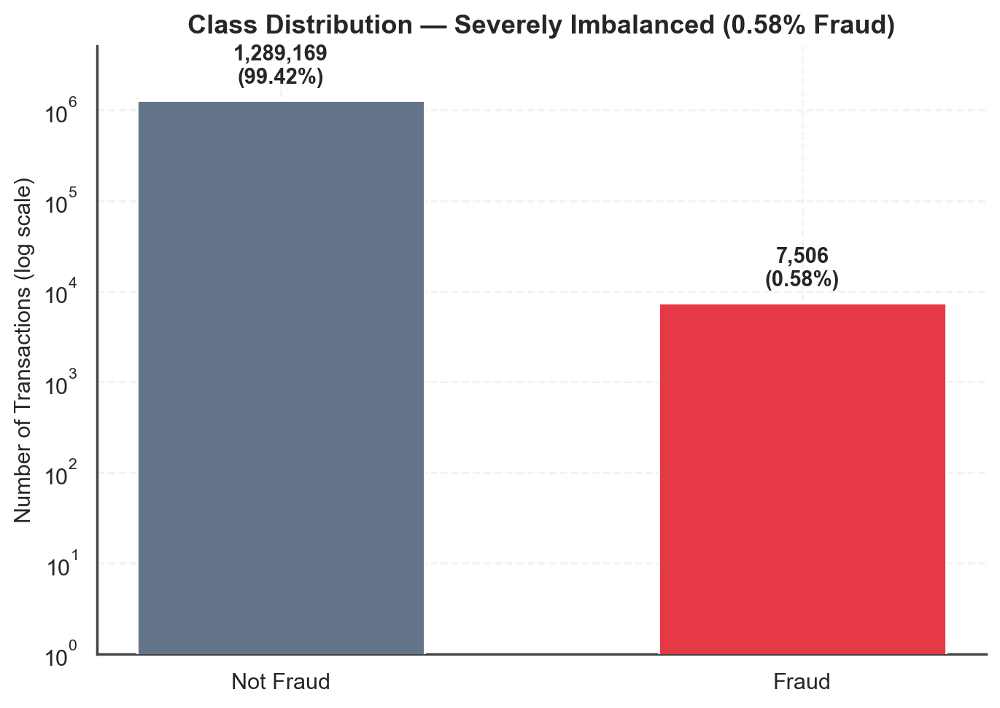

# 💳 Credit Card Fraud Detection


An end-to-end classification project detecting fraudulent transactions in a severely imbalanced dataset (0.58% fraud), comparing a baseline model against a class-weighted model using metrics built for imbalanced data — precision, recall, F1, ROC-AUC and PR-AUC — instead of misleading accuracy.

## Problem Statement

Credit card fraud is rare but costly. A fraud classifier has to catch as much fraud as possible (**recall**) without generating so many false alarms that analysts stop trusting it (**precision**). With fraud at well under 1% of transactions, a model can score 99%+ accuracy while catching none of it — so this project treats accuracy as a red flag, not a target, and evaluates models on the metrics that actually matter for imbalanced classification.

## Dataset

- **Source:** [Credit Card Transactions Fraud Detection Dataset – Kaggle](https://www.kaggle.com/datasets/kartik2112/fraud-detection)
- **Size:** 1,296,675 simulated transactions × 23 raw columns (cardholder, merchant, transaction metadata)
- **Target:** `is_fraud` — **7,506 fraud cases (0.58%)**
- **Not committed to this repo** (~350 MB) — see [`data/README.md`](data/README.md) for download steps.

## Workflow

1. Business Problem
2. Data Loading
3. Data Cleaning
4. Exploratory Data Analysis
5. Feature Engineering — cardholder age, merchant-cardholder distance, transaction month
6. Preprocessing — label encoding + scaling
7. Model Building — baseline Decision Tree
8. Handling Class Imbalance — `class_weight='balanced'` Decision Tree
9. Model Evaluation & Comparison
10. Conclusion

## Key Results

**Test set:** 389,003 transactions, 2,265 of them fraud.

| Model | Accuracy | Precision (fraud) | Recall (fraud) | F1 (fraud) | ROC-AUC | PR-AUC |
|---|---|---|---|---|---|---|
| Decision Tree — Original | 0.9959 | 0.640 | 0.669 | 0.654 | **0.833** | 0.430 |
| Decision Tree — `class_weight='balanced'` | 0.9963 | **0.692** | 0.648 | **0.669** | 0.823 | **0.450** |

`class_weight='balanced'` reduces false positives by ~23% (853 → 654) and improves F1/PR-AUC, at the cost of catching slightly less fraud (1,467 vs. 1,515 true positives) — a genuine precision/recall trade-off, not a one-sided win. Full reasoning, confusion matrices, and limitations are in the notebook's Conclusion section.

*(The baseline Decision Tree is now seeded with `random_state=99` for reproducibility — earlier runs without a fixed seed varied by roughly ±1 point on these metrics.)*

### Model Performance Comparison


### Confusion Matrices


### Precision-Recall Curve


### Class Distribution


## Tech Stack

Python · pandas · NumPy · scikit-learn · SciPy · Matplotlib · Seaborn · Jupyter

## How to Run

```bash
git clone https://github.com/Dt-Ansari07/credit-card-fraud-detection.git
cd credit-card-fraud-detection
pip install -r requirements.txt
```

Then download the dataset per [`data/README.md`](data/README.md) into `data/fraudTrain.csv`, and run:

```bash
jupyter notebook notebooks/credit_card_fraud_detection.ipynb
```

**Note on scale:** the full dataset (1.3M rows) is used as-is — loading and training both Decision Trees takes well under a minute on a typical laptop, so no sampling was needed.

## Project Structure

```
credit-card-fraud-detection/
├── data/
│   └── README.md                      # Kaggle link + download steps (fraudTrain.csv is gitignored)
├── notebooks/
│   └── credit_card_fraud_detection.ipynb
├── src/
│   ├── evaluation.py                   # reusable fraud-metrics helper
│   └── plotting.py                     # shared chart style + plotting functions
├── images/                            # exported charts used in this README
├── requirements.txt
├── .gitignore
├── LICENSE
└── README.md
```

## Author

**Zulfiqar Ansari**
[LinkedIn](https://linkedin.com/in/zulfiqar-ansari) · [Portfolio](https://dt-ansari07.github.io/portfolio-v2/)
